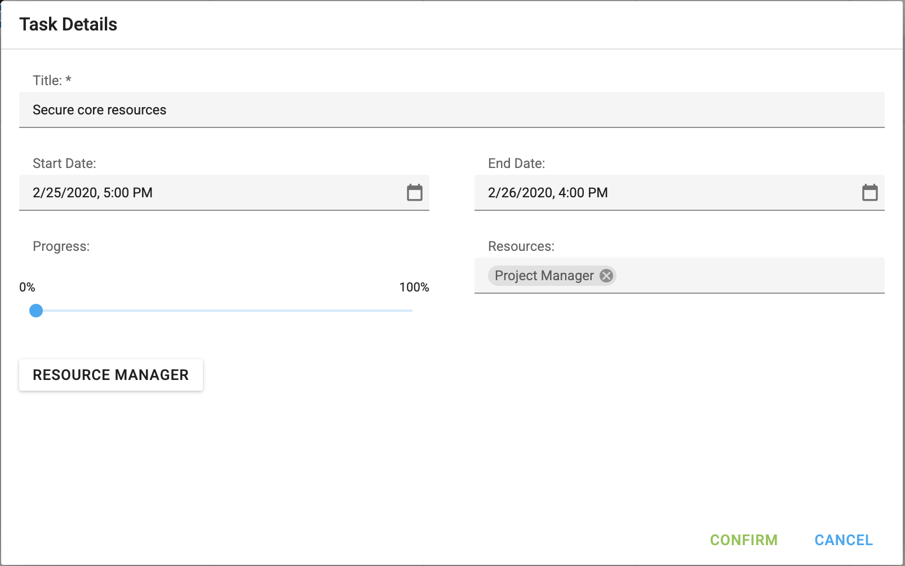

<!-- default badges list -->

[](https://supportcenter.devexpress.com/ticket/details/T949655)
[](https://docs.devexpress.com/GeneralInformation/403183)
[](#does-this-example-address-your-development-requirementsobjectives)
<!-- default badges end -->

# Gantt for DevExtreme ASP.NET MVC - How to implement a custom "Task details" dialog

This example demonstrates how display a custom "Task details" dialog instead of the default dialog. 



## Implementation Details

1. Add a popup edit form in your application.
   
```csharp
	@(Html.DevExtreme().Popup()
	    .ID("taskDetailsPopup").MaxWidth(800).MaxHeight(500).Title("Task Details")
	    .ContentTemplate(new TemplateName("customPopupContentTemplate"))
	    .ToolbarItems(items => {
	        items.Add()
	            .Widget(editor => editor.Button()
	                .Text("Confirm")
	                .Type(ButtonType.Success)
	                .OnClick("onConfirmClick")
	            )
	            .Location(ToolbarItemLocation.After)
	            .Toolbar(Toolbar.Bottom);
	        items.Add()
	            .Widget(editor => editor.Button()
	                .Text("Cancel")
	                .Type(ButtonType.Success)
	                .OnClick("onCancelClick")
	            )
	            .Location(ToolbarItemLocation.After)
	            .Toolbar(Toolbar.Bottom);
	    })
	    .OnInitialized("onPopupInitialized").OnShown("onShown")
	)
```

```js
    function onPopupInitialized(e) {
        popup = e.component;
    }
```

2. Handle the [taskEditDialogShowing](https://js.devexpress.com/jQuery/Documentation/ApiReference/UI_Components/dxGantt/Events/#taskEditDialogShowing) event to prevent the default dialog and display your custom dialog instead. Bind the form in the popup control to processed task data.

```js
    function onTaskEditDialogShowing(e) {
        e.cancel = true;
        showTaskDetails(gantt.getTaskData(e.key))
    }
    function showTaskDetails(data) {
        popup.option("visible", true);
        if (form)
            form.option('formData', data);
    }
```

3.  Call the [updateTask](https://js.devexpress.com/jQuery/Documentation/ApiReference/UI_Components/dxGantt/Methods/#updateTaskkey_data) and [assignResourceToTask](https://js.devexpress.com/jQuery/Documentation/ApiReference/UI_Components/dxGantt/Methods/#assignResourceToTaskresourceKey_taskKey)/[unassignResourceFromTask](https://js.devexpress.com/jQuery/Documentation/ApiReference/UI_Components/dxGantt/Methods/#unassignResourceFromTaskresourceKey_taskKey) methods to update Gantt data.

```js
 	function onConfirmClick(e) {
        let result = form.validate();
        if (result.isValid) {
            var data = form.option("formData");
            gantt.updateTask(data.Key, data);
            gantt.unassignAllResourcesFromTask(data.Key);
            data.Resources.forEach(r => gantt.assignResourceToTask(r, data.Key));
            popup.hide();
        }
    }
```

## Files to Review

- **Angular**
    - [app.component.html](Angular/src/app/app.component.html)
    - [app.component.ts](Angular/src/app/app.component.ts)
- **React**
    - [App.tsx](React/src/App.tsx)
- **Vue**
    - [HomeContent.vue](Vue/src/components/HomeContent.vue)
- **jQuery**
    - [index.html](jQuery/src/index.html)
    - [index.js](jQuery/src/index.js)
- **ASP.NET Core**
    - [Index.cshtml](ASP.NET%20Core/Views/Home/Index.cshtml)


## Documentation

- [Gantt - Getting Started](https://js.devexpress.com/Documentation/Guide/UI_Components/Gantt/Getting_Started_with_Gantt/)
- [Gantt - taskEditDialogShowing Event](https://js.devexpress.com/Documentation/ApiReference/UI_Components/dxGantt/Events/#taskEditDialogShowing)
- [Gantt - updateTask Method](https://js.devexpress.com/jQuery/Documentation/ApiReference/UI_Components/dxGantt/Methods/#updateTaskkey_data)
- [Gantt - assignResourceToTask Method](https://js.devexpress.com/Documentation/ApiReference/UI_Components/dxGantt/Methods/#assignResourceToTaskresourceKey_taskKey)
- [Gantt - unassignResourceFromTask Method](https://js.devexpress.com/Documentation/ApiReference/UI_Components/dxGantt/Methods/#unassignResourceFromTaskresourceKey_taskKey)

<!-- feedback -->
## Does This Example Address Your Development Requirements/Objectives?

[](https://www.devexpress.com/support/examples/survey.xml?utm_source=github&utm_campaign=devextreme-gantt-how-to-create-a-custom-task-details-dialog&~~~was_helpful=yes) [](https://www.devexpress.com/support/examples/survey.xml?utm_source=github&utm_campaign=devextreme-gantt-how-to-create-a-custom-task-details-dialog&~~~was_helpful=no)

(you will be redirected to DevExpress.com to submit your response)
<!-- feedback end -->
